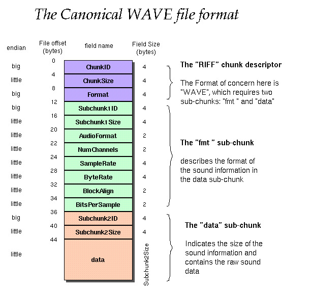

# Raw Audio

## Build instructions
```shell script
cmake .
make
```

## Execute
```shell script
./audio
```

### Visualise binary audio as bytes
```shell script
hexedit sample.wav
```

### WAVE file format
